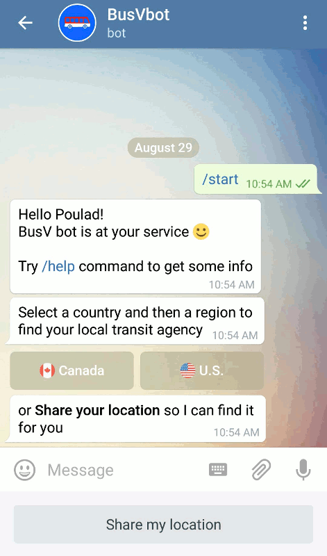

[](https://t.me/BusVbot)
[](https://travis-ci.org/pouladpld/BusVbot)

# 🚍 BusV Bot 🤖

[](https://t.me/BusVbot)

**BusV** is a Telegram chat bot 🤖 that helps you catch your bus 🚍 by providing you route information and bus predictions. Start chatting with it on Telegram to find out more: [`@BusVbot`](https://t.me/BusVbot).

This bot works best for passengers who take frequent routes and already know what bus they should take to reach their destinations.

[](https://t.me/BusVbot)

Supporting 60 transit agencies in North America, the real-time bus predictions are powered by [NextBus](https://www.nextbus.com).

Here are the regions that agencies operate in:

| Canada | U.S |
| :----- | :-- |
| Ontario, Quebec | California-Northern, California-Southern, District of Columbia, Florida, Georgia, Indiana, Iowa, Kentucky, Maryland, Massachusetts, Mississippi, Nevada, New Jersey, New York, North Carolina, Oregon, Pennsylvania, Texas, Virginia, Washington |

## Build and Run

BusVbot is built using [`Telegram.Bot.Framework`](https://github.com/pouladpld/Telegram.Bot.Framework) as an ASP.NET Core app.

### Requirements

- Visual Studio 2017 or [.NET Core 1.1](https://github.com/dotnet/core/blob/master/release-notes/download-archive.md)
- Postgres database
- Telegram Bot API token

### Configurations

Make a copy of [appsettings.json](./src/BusVbot/appsettings.json) in project folder and name it `appsettings.Development.json`:

```bash
cp -v src/BusVbot/appsettings{,.Development}.json
```

Edit the `appsettings.Development.json` file and put your _bot name_,  _API token_, and _Postgres connection string_ values there.

> There are other options to provide the app with configurations. Have a look at first few lines of [Startup class](./src/BusVbot/Startup.cs).

> Note that `appsettings.Development.json` is gitignored so it is safe to store the app secrets there.

### Database

Run the Postgres database. Examples here are using docker containers.

```bash
# create and start the container
docker run -d -p 5432:5432 --name busvbot-postgres -e POSTGRES_PASSWORD=password -e POSTGRES_USER=busvbot -e POSTGRES_DB=busvbot postgres
```

> See [`docker-local.sh`](./src/scripts/docker-local.sh) for sample docker commands to use.

### Seed Data

While running in _Development_ environment, app makes sure database is seeded with data from NextBus before it starts the bot.

It might take a while to download all the data so in order to save time, use the [sql dump file](./src/BusVbot/Data/nextbus-dump.sql) and its `INSERT` statements instead.

Create schema:

```bash
cd src/BusVbot
dotnet restore
dotnet ef database update
```

Insert data:

```bash
# inside docker container, as postgres user
psql -U busvbot < nextbus-dump.sql
```

### Run

Run the app and start chatting with the bot on Telegram.